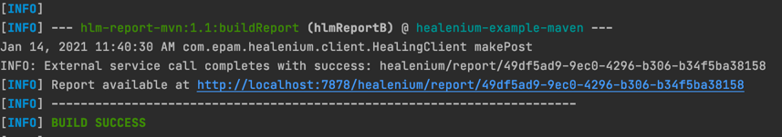
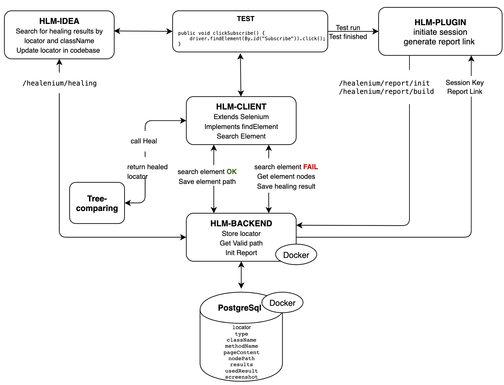
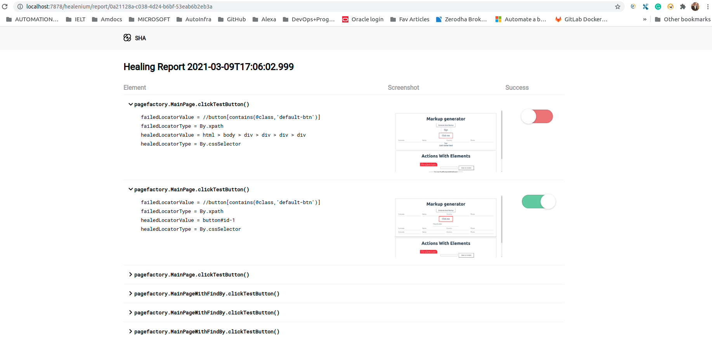

###This is a sample Project to test Self Healing Capabilities of Healinium
for more information on healenium, visit healenium.io

Healenium is a Opensource webdriver wrapper from EPAM which has the ability of self healing tests. Healenium Driver implements selenium webdriver by adding try catch mechanism for No element found execption. when an element is not found Healenium backend will recollect the earlier locator values of the test and try to heal them.
#### Steps to Use this Repo

Step1: Clone this repo

Step2: go to DockerFiles/Healenium folder and run 'docker-compose up -d' comand and Make sure the containers are UP and running

Step3: go to Pom.xml folder and run 'mvn clean test'

Step 4: once execution is finished you will see the Healenium report generated with logs like below

<h2 align="center">Healenium Architecture</h2>

<h2 align="center">Healenium Dashboard</h2>

